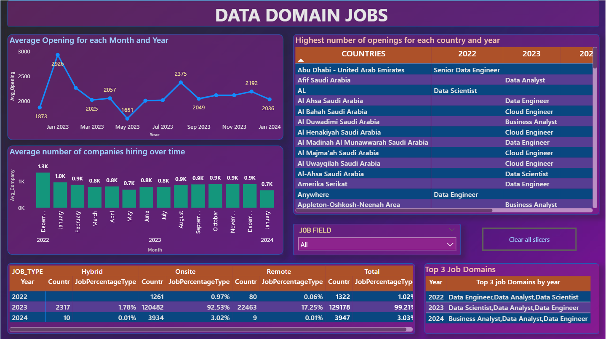
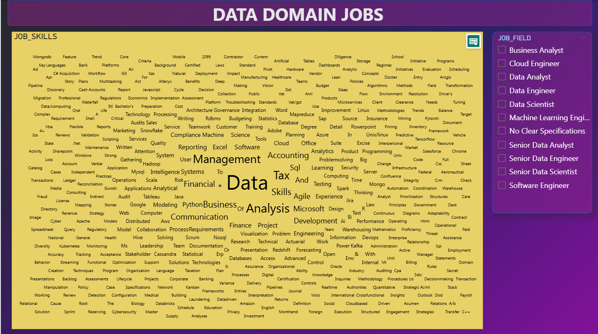

# 📊 Data Domain Jobs Analysis – Power BI Dashboard

## 📌 Project Overview
Our client, a recruitment and selection firm, recently acquired a **large volume of job market data** from multiple sources to respond to a surge in job inquiries within the data field.  
The data was highly **disorganised, inconsistent, and fragmented**, making it challenging to extract actionable insights.  
This project involved **data cleaning, structuring, integration, and visualization** using **Power BI**, ensuring optimal performance with over **700,000+ rows of data**.

---

## 🛠 Problem Statement
The client faced difficulties in:
1. **Understanding hiring trends** over the years to optimise recruitment strategies.
2. **Analysing job type distribution** (Onsite, Hybrid, Remote) across different years.
3. **Identifying highest job openings per country and year** for targeted recruitment.
4. **Tracking average companies hiring over time** to gauge market activity.
5. **Determining top 3 job fields yearly** for strategic workforce planning.
6. **Identifying most in-demand skills** to align with market needs.

---

## ⚠️ Key Challenges
- **Data Inconsistencies & Missing Information**  
  - Unstructured job descriptions with embedded critical details.
- **Fragmented Data Tables**  
  - Multiple poorly connected datasets from various sources.
- **Large Dataset Size**  
  - 700K+ rows required performance-optimised Power BI reports.
- **Integration Needs**  
  - Creation of a consolidated database schema for future use.

## Data Cleaning
- During the process, a **skills-related data issue** was identified — multiple skills for the same **Job_id** were stored in separate rows.  
To solve this, **Python** was used to **aggregate all skills for each job into a single record**, ensuring a cleaner, more structured dataset before loading into **Power BI**. 
- In **Power Query (M Language)**, logic was applied to:
- Classify **Job Employment Types** (Full-Time, Part-Time, Contract, Internship, Temporary, Freelance, Permanent, Not Specified) based on keywords in the `SUMMARY` column.
- Standardize **Job Titles** into defined categories (e.g., Business Analyst, Cloud Engineer, Data Analyst, Data Engineer, Data Scientist, Machine Learning Engineer, Senior roles, Software Engineer) by scanning and matching patterns in the `JOB_TITLE` column.
- Removed duplicates, handled missing values, and standardized column naming.
- Ensured relationships between tables were correctly defined before loading into the Power BI model.

---

## 📂 Final Database Schema
| Column Name         | Description |
|--------------------|-------------|
| **Job_id**         | Unique identifier for each job posting |
| **Job title**      | Name of the job position |
| **Job_field**      | Specific field/industry (e.g., Data Science, Data Engineering) |
| **Company name**   | Hiring organisation |
| **Job_location**   | Geographical location |
| **Job_posting_date** | Posting date of the job |
| **Job_level**      | Experience level (Entry, Mid, Senior) |
| **Job_type**       | On-site, Hybrid, Remote |
| **Job_skills**     | Required/preferred skills |
| **Job_employment_type** | Contractual, Permanent |
| **Summary**        | Brief description of the role |

---

## 📈 Dashboard Insights
The Power BI dashboard delivers:
1. **Hiring Trends Over Time** – Identifying peak months & yearly patterns.
2. **Job Type Distribution** – Onsite, Hybrid, and Remote split per year.
3. **Top Openings by Country & Year** – Geographical hiring patterns.
4. **Average Companies Hiring** – Market activity tracking.
5. **Top 3 Job Fields by Year** – Sector demand trends.
6. **In-Demand Skills Word Cloud** – Skills driving the job market.

---

## 📷 Dashboard Previews

### 2️⃣ Job Trends & Analysis

### 1️⃣ Skills Word Cloud

---

## 🔍 Key Findings
- **January 2023** saw the highest hiring activity with **~2926 openings**.
- **Hybrid jobs** dominated in 2023, making up **92.53%** of postings.
- **Saudi Arabia & UAE** emerged as major hiring hubs for Data Engineering & Data Science roles.
- **Top fields** remained consistent: Data Engineer, Data Analyst, Data Scientist — with slight variations year-to-year.
- **Most in-demand skills** included Management, Data Analysis, SQL, Python, and Communication.

---

## 💡 Recommendations
1. **Align recruitment cycles** with peak hiring months (e.g., January, September) to maximise candidate outreach.
2. **Focus on hybrid opportunities** as they continue to dominate market share.
3. **Invest in skill development** programs for SQL, Python, and Data Analysis to match demand trends.
4. **Strengthen presence in Saudi Arabia & UAE**, given consistent high demand.
5. **Leverage top 3 job fields** insights to guide marketing, job postings, and training focus.

---

## 🚀 Tools & Technologies
- **Power BI** – Data transformation, modelling, and visualisation
- **Python** – Data preprocessing, skill aggregation for each Job_id
- **SQL** – Database creation & optimisation
- **DAX** – Advanced calculations
- **Power Query** - Used m language extensively
- **ETL Techniques** – Data cleaning & integration 

---

## ✅ Key Outcomes
- Consolidated fragmented data into a **single, clean database**.
- Built a **performance-optimised Power BI dashboard** handling 700K+ rows.
- Delivered actionable insights for **strategic recruitment planning**.
- Enabled the client’s in-house team to use the new database for **future reporting**.

---